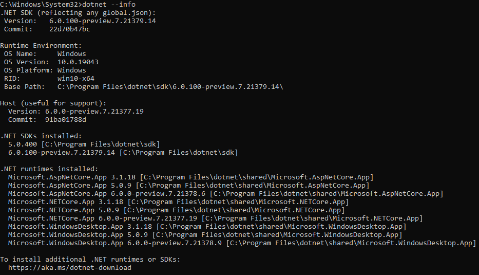

# .NET Multi-platform App UI (.NET MAUI) MauiBasicCalculator 
## Workspace Requirements 
- https://docs.microsoft.com/en-us/dotnet/maui/get-started/installation

This is a very basic port of the Xamarin Sample located at https://github.com/xamarin/mobile-samples/tree/main/LivePlayer/BasicCalculator

**NOTE: I used a preview version of Visual Studio 2022 when developing this and only tested it on an Android emulator.

